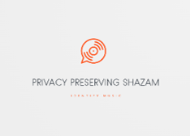

# Ppazam
A privacy preserving version of Shazam using Concrete ML
Problem statement taken from [Create a privacy preserving version of Shazam using Concrete and/or Concrete ML](https://github.com/zama-ai/bounty-program/issues/79)

## Table of Contents
- [Conceptual Architecture](#conceptual-architecture)
- [Proof of Concept](#proof-of-concept)
- [Implementation](#quantization-aware-implementation)
- [Evaluation](#evaluation)
- [Next steps](#next-steps)
## Conceptual Architecture
### 1. How Shazam architecture would look like if built today
Shazam problem statement is best described in the terms of Semantic search. If approached today from scratch, the most efficient approach would likely consist of the following steps:
 - embed music library tracks with one of readily available audio embediding models (preferably, ones honed speficically for music content)
 - store the embeddings in a Vector Store of choice
 - at query time, run a search query agianst the Vector Store
These days, plenty of tools are available to implement such a solution quickly and efficiently.
However this approach is **not FHE friendly**. The embeddings of the library conntent are done once, and stored in clear - while in our case a query (audio sample) comes encrypted. Hence need to look to an alternative approach
### 2. Classification to the rescue
An audio track classification model can however be made FHE friendly. We would train such a model in clear, and (given the model is FHE enabled) run inferenece on an encrypted query, yielding an encrypted result (track id) which the user would then decrypt. This would achieve the goal of privacy preserving track identification.
In this work, we pick the following choices towards creating an audio track classification model:
 - with the help of spectrogram extraction from audio, transform audio classification task into image classification task (as recommended e.g. in [HuggingFace Audio Course](https://huggingface.co/learn/audio-course/chapter3/classification)
 - as we need to simulate noisy queries - use audio augmentation techniques to create datasets for audio (eventually image) classicification
 - leverage on [Concrete ML image classification use case example](https://github.com/zama-ai/concrete-ml/tree/main/use_case_examples/cifar/cifar_brevitas_finetuning) for building an FHE enabled solution.

Transforming audio classification task to image classicfication. Training and inference. A would-be solution would look like this:

However this approach has a significant drawback - it's **not scalable**. Classification accuracy would significantly deteriorate with a size of the music library. Need to refine this approach for better scalability
### 3. Two-stage classification
A refined approach we're taking is of a two-stage classification. The idea is to break down the whole library into groups of tracks (clusters), and traing two classification models
 - a model to classify tracks onto clusters (single model)
 - an intra-cluster classification model, to classify tracks within a single given cluster (need to train `num_clusters` such models)
For a `fma_small` library, we've chosen `num_clusters=80` so than an average cluser size would be around 100 tracks - which seems a very reasonable starting point for highly accurate intra-cluster classification models

An overview of training an intra-cluster classification model

An overview of training an intra-cluster classification mode

Indeed, as a foundation for both models there is a need to have a reasonable clusterization of the music library. This will be reviewed in the following section
## Proof of Concept 
We approach construction of the solution in two waves:
 1. Proof of concept in clear. The objective of this effort is to assess feasibility and accuracy of a solution in clear, as a baseline for a FHE-enabled solution. As well, at this stage we develop many assets (datasets and models) which are then reused for construction of the FHE-enabled model
 2. FHE enabled solution

We're now focusing on the first wave. For PoC we use a `fma_small` music library (see discussion on larger datasets at [Next steps](#next-steps))

## Quantization aware implementation

## Evaluation

## Next steps

