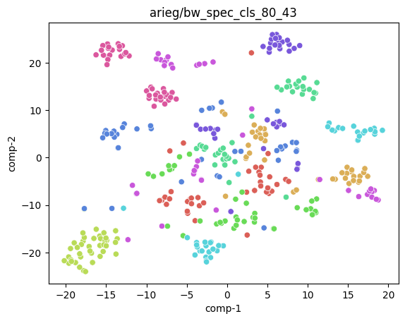
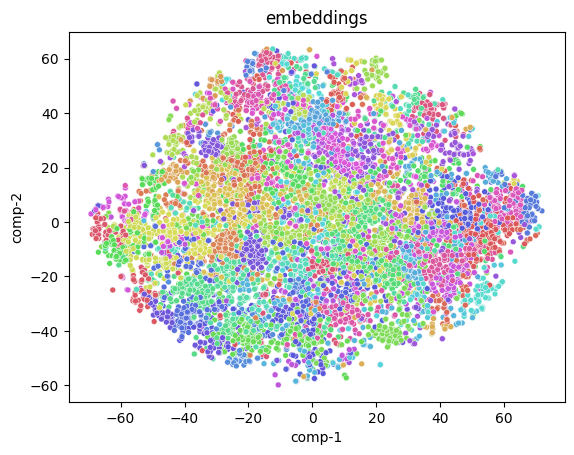
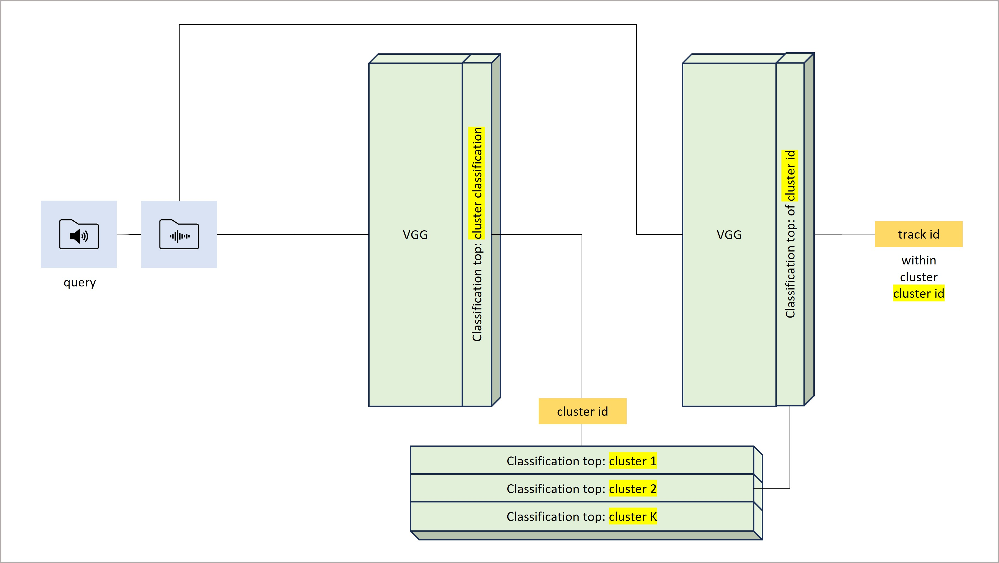
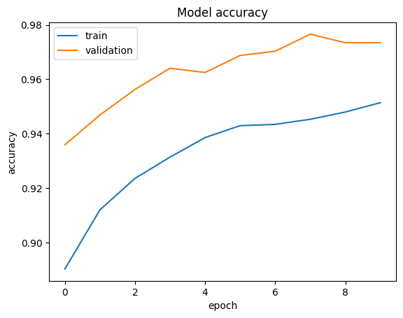
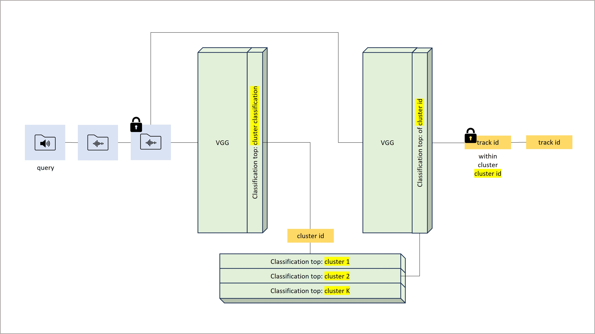

# Ppazam
A privacy preserving version of Shazam using Concrete ML
Problem statement taken from [Create a privacy preserving version of Shazam using Concrete and/or Concrete ML](https://github.com/zama-ai/bounty-program/issues/79)

## Table of Contents
- [Conceptual Architecture](#conceptual-architecture)
- [Proof of Concept](#proof-of-concept)
- [Implementation](#quantization-aware-implementation)
- [Evaluation](#evaluation)
- [Next steps](#next-steps)
## Conceptual Architecture
### 1. How Shazam architecture would look like if built today
Shazam problem statement is best described in the terms of Semantic search. If approached today from scratch, the most efficient approach would likely consist of the following steps:
 - embed music library tracks with one of readily available audio embediding models (preferably, ones honed speficically for music content)
 - store the embeddings in a Vector Store of choice
 - at query time, run a search query agianst the Vector Store
These days, plenty of tools are available to implement such a solution quickly and efficiently.
However this approach is **not FHE friendly**. The embeddings of the library conntent are done once, and stored in clear - while in our case a query (audio sample) comes encrypted. Hence need to look to an alternative approach
### 2. Classification to the rescue
An audio track classification model can however be made FHE friendly. We would train such a model in clear, and (given the model is FHE enabled) run inferenece on an encrypted query, yielding an encrypted result (track id) which the user would then decrypt. This would achieve the goal of privacy preserving track identification.
In this work, we pick the following choices towards creating an audio track classification model:
 - with the help of spectrogram extraction from audio, transform audio classification task into image classification task (as recommended e.g. in [HuggingFace Audio Course](https://huggingface.co/learn/audio-course/chapter3/classification)
 - as we need to simulate noisy queries - use audio augmentation techniques to create datasets for audio (eventually image) classification
 - leverage on [Concrete ML image classification use case example](https://github.com/zama-ai/concrete-ml/tree/main/use_case_examples/cifar/cifar_brevitas_finetuning) for building an FHE enabled solution.

Transforming audio classification task to image classification. Training and inference. A would-be solution would look like this:

However this approach has a significant drawback - it's **not scalable**. Classification accuracy would significantly deteriorate with the size of the music library. Need to refine this approach for better scalability
### 3. Two-stage classification
A refined approach we're taking is of a two-stage classification. The idea is to break down the whole library into groups of tracks (clusters), and train two classification models
 - a model to classify tracks onto clusters (single model)
 - an intra-cluster classification model, to classify tracks within a single given cluster (need to train `num_clusters` such models)
For a `fma_small` library, we've chosen `num_clusters=80` so than an average cluser size would be around 100 tracks - which seems a very reasonable starting point for highly accurate intra-cluster classification models

An overview of training an intra-cluster classification model

An overview of training an intra-cluster classification mode

Indeed, as a foundation for both models need to have a suitable clusterization of the music library. This will be reviewed in the following section
## Proof of Concept 
We approach construction of the solution in two waves:
 1. Proof of concept in clear. The objective of this effort is to assess feasibility and accuracy of a solution in clear, as a baseline for a FHE-enabled solution. As well, at this stage we develop many assets (datasets and models) which are then reused for construction of the FHE-enabled model
 2. FHE enabled solution

We're now focusing on the first wave. For PoC we use a `fma_small` music library (see discussion on larger datasets at [Next steps](#next-steps))

In order to train various types and flavors of models, need to prepare multiple datasets of spectrogram images. This is done in [Image_dataset_from_FMA.ipynb](Image_dataset_from_FMA.ipynb) notebook. 

### Audio augmentations
 - for audio augmentations we use the [`audiomentations`](https://github.com/iver56/audiomentations) library
 - we produce three levels of audio augmentations - `small`, `medium` and `large` (see `augment_policies` dict in the notebook). The idea is to train the models on `large` augmentations for maximum resilience. In the [Evaluation](#evaluation) section, we will be testing the system on queries of all the three levels of augmentations, and observe differences in resulting accuracy
 - as a part of `medium` and `large` augmentations, we use [ESC: Dataset for Environmental Sound Classification](https://huggingface.co/datasets/ashraq/esc50) as a source of background noises. The idea is to train the system to be robust for queries with background noise

The resulting datasets were uploaded to [HuggingFace Hub](https://huggingface.co/arieg). These are the datasets of interest:
 - `arieg/cluster{XX}_large_150` - 150 large augmentations for each of the clusters, XX is a cluster id. Used for training of intra-cluster classification model
 - `arieg/8000_large_4_siamclusters` - spectrogram of an original audio, plus 4 large augmentations per each of 8000 tracks. Used for training of cluster classification model
 - `arieg/cluster{XX}_{augmentation}_10` - 10 augmented tracks per cluster, with each of 3 levels of augmentation. Used for end-to-end testing

### Clustering
Several experiments demonstrated that the discriminating power of spectrogram based image classification model is quite strong, even on noisy (`large` augmentation) queries. Hence, with the two-staged classification approach, special attention should be paid to the first stage, cluster classification - need to ensure sufficient discriminating power between clusters. For this, need to ensure that tracks belonging to one cluster are "similar", while tracks belonging to different clusters are less "similar". A normative way to achieve such clustering is to use audio (or audio spectrogram) embeddings as a baseline for tracks "similarity" measure

We have tried several of-the-shelve audio embeddings methods:
 - [MERT-v1-95M](https://huggingface.co/m-a-p/MERT-v1-95M)
 - [OpenCLIP](https://github.com/mlfoundations/open_clip)
 - [YAMNet](https://www.tensorflow.org/hub/tutorials/yamnet)
 - [OpenL3](https://github.com/marl/openl3)

to find that cluster classification models, with clustering based on these embedding methods, give dissatisfactory results

Given that, we have developed a custom embedding model, based on Siamese Contrastive Learning

Implementation in [Embeddings_training.ipynb](Embeddings_training.ipynb)
Based on embeddings model, we perform clustering using [faiss](https://github.com/facebookresearch/faiss) implementation in the [Clustering.ipynb](Clustering.ipynb) notebook

 - As an illustration, a t-SNE plot of embeddings of several tracks with `large` augmentations. Augmentations of a same track designated by the same color

 - t-SNE plot of embeddings of the whole `fma_small` dataset, color code per cluster

### Intra-cluster track classification

VGG19 based implementation in the [PoC_intra_cluster_classification_training.ipynb](PoC_intra_cluster_classification_training.ipynb) notebook
### Cluster classification

The same model is used as for intra-cluster track classification

VGG19 based implementation in the [PoC_cluster_classification_training.ipynb](PoC_cluster_classification_training.ipynb) notebook

### PoC Evaluation
A diagram illustrating an end-to-end flow

We use `arieg/cluster{XX}_{augmentation}_10` datasets for several sample clusters, with each of 3 levels of augmentation. We run tracks from these datasets through the end-to-end flow, and measure top-1 and top-3 hits. Evaluation is implemented in the [PoC_end_to_end_evaluation.ipynb](PoC_end_to_end_evaluation.ipynb) notebook

We observed the following representative results:
|        | cluster00_small_10 | cluster00_medium_10 | cluster00_large_10 |
| --- | :---: | :---: | :---: |
| Top-1 | 0.90 | 0.72 | 0.60 |
| Top-3 | 0.99 | 0.89 | 0.85 |

|        | cluster01_small_10 | cluster01_medium_10 | cluster01_large_10 |
| --- | :---: | :---: | :---: |
| Top-1 | 0.63 | 0.44 | 0.32 |
| Top-3 | 0.93 | 0.72 | 0.59 |

|        | cluster02_small_10 | cluster02_medium_10 | cluster02_large_10 |
| --- | :---: | :---: | :---: |
| Top-1 | 0.83 | 0.58 | 0.43 |
| Top-3 | 0.97 | 0.77 | 0.64 |

The observation is that the weaker link of the two-staged classification is the first stage of cluster classification. Intra-cluster classification demonstrates strong performance, as illustrated by a typical learning curve

## Quantization aware implementation

### The baseline
For Quantization aware implementation, we leverage on [Concrete ML image classification use case example](https://github.com/zama-ai/concrete-ml/tree/main/use_case_examples/cifar/cifar_brevitas_finetuning)
The benefit we've gained from extensive investment in the PoC is that now we need to develop only two models - fp32 and quanitized image classification. All the work done in PoC on clustering stays intact, as we use here clusterization as sone at the PoC.
 - fp32 model implemented in [Fp32_model_training.ipynb](Fp32_model_training.ipynb) notebook
 - quantized model implemented in [Quantization_aware_training_and_evaluation.ipynb](Quantization_aware_training_and_evaluation.ipynb) notebook

The following diagram illustrates a quantized end-to-end flow

### Modifications
The following noticeable changes implemented on top of the baseline Concrete ML example:
 1. Change the models to support 3x224x224 image inputs, rather that 3x32x32 as in the original example
 2. Hit an issue of concrete-ml installation resulting in versions conflict on several libraries, including `torchvision` (as appears in the output of the `!pip install  concrete-ml brevitas` cell of the quantized model notebook). To circumvent the issue, needed to separate fp32 and quantized training into two notebooks, and transfer intermediate torch datasets from one notebook to another (for QAT) via cloud storage
 3. IMHO found in the example a mismatch between kernel sizes of the AvgPool2d of `Fp32VGG11` (residing between the features and the final layer), and the last AvgPool2d of `QuantVGG11` features. Fixed

### Results
The resulting `state_dict`'s of classification models (both cluster and intra-cluster ones), as well as training history of all these models, can be found [here](https://drive.google.com/drive/folders/15rX2vmkOumePB3aI_VkQKhXbhpsSqAlJ?usp=sharing)

The fp32 results reside in the referred folder, and quantized model training results reside in the `quant` subfolder of this folder

## Evaluation
End-to-end evaluation of the quantized system implemented in the `End to End test` section of the [Quantization_aware_training_and_evaluation.ipynb](Quantization_aware_training_and_evaluation.ipynb) notebook. Implementation follows the same methodology as end-to-end evaluation of the clear system performed at the PoC. 

Results are saved in a [e2e_test_results.csv](e2e_test_results.csv) file

## Next steps

